<h3><code>harshpal130@github ~ $ whoami</code></h3>

 
 

<h3><code>harshpal130@github ~ $ ./contributions.sh</code></h3>

 
 

<h3><code>harshpal130@github ~ $ ./links.sh</code></h3>

<b>Developer · AI/ML Enthusiast · Builder</b>

